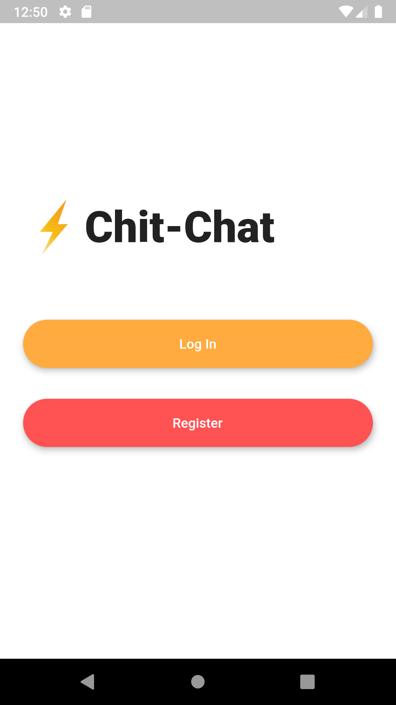
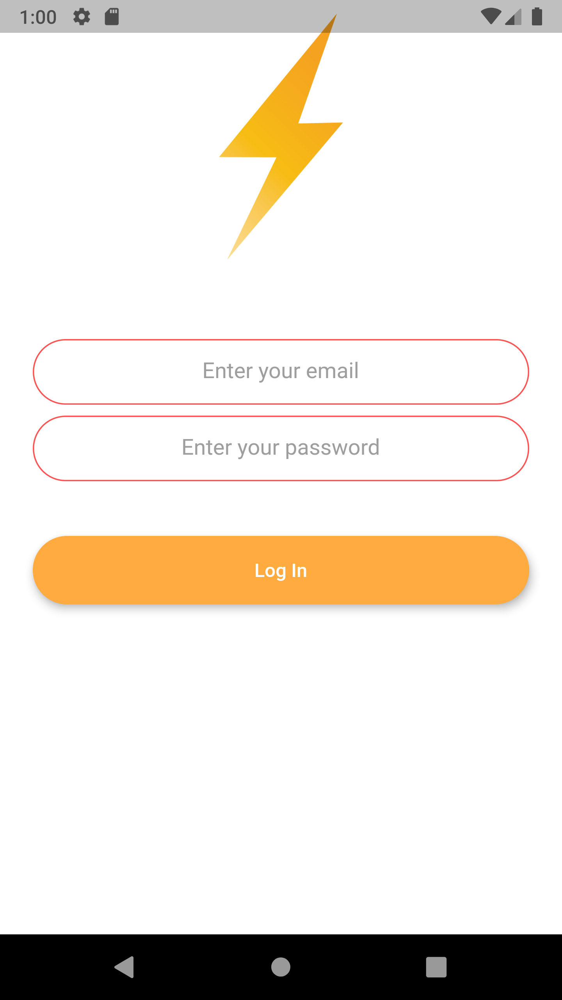
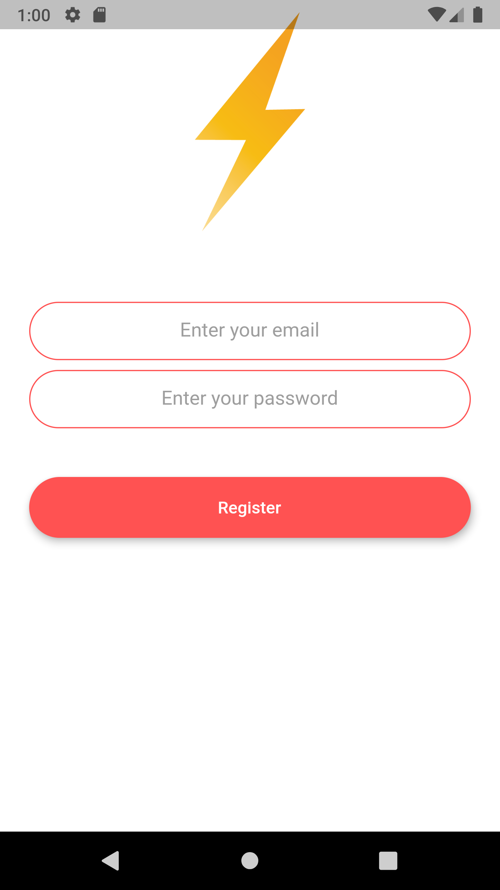
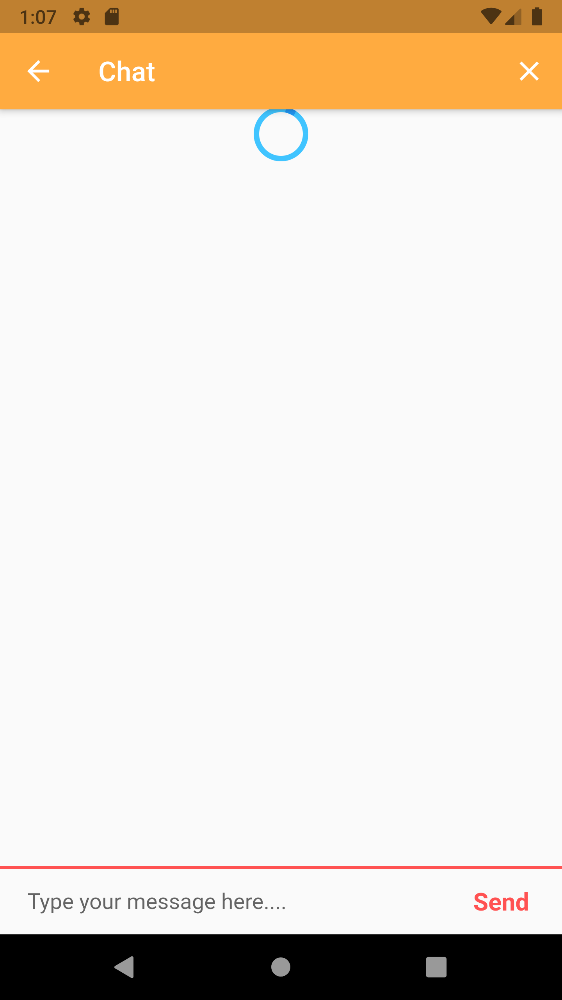
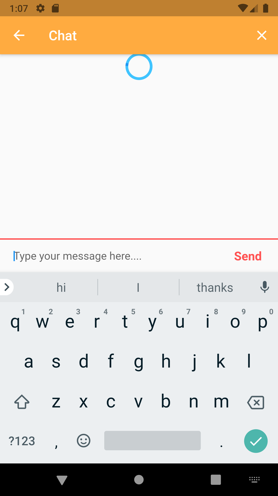
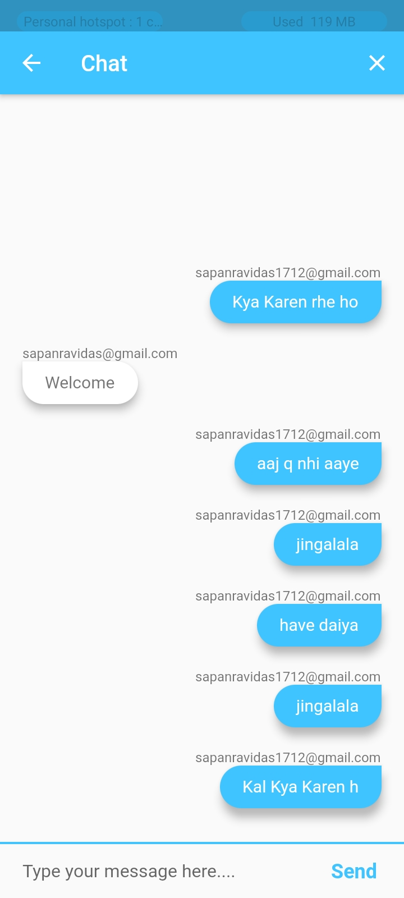

# Chit-Chat

This is my flutter-chat initiative app. 

  
   
  
  
  
  
  

Todo: 

1. Use socket instead of flutter-stream
1. Change/Update user profile
1. Add features like file sharing
1. Access to contacts in phone
1. Can chat like whatsapp in personal or group.

